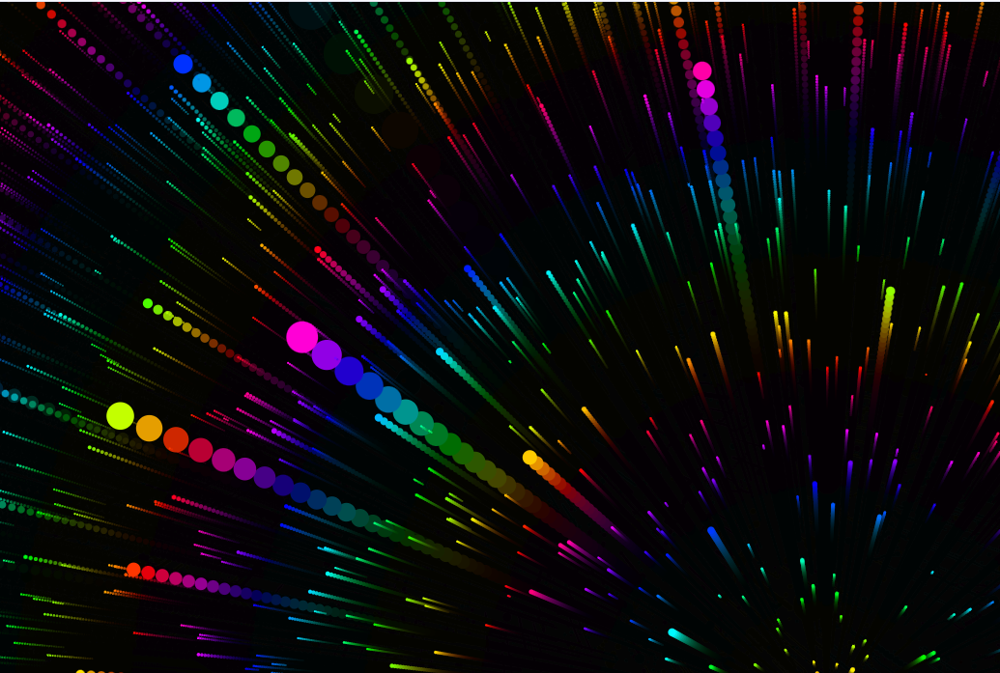

# 🌌 Starfield Animation

An interactive, colorful starfield animation built with HTML5 `<canvas>`, JavaScript, and CSS. This effect creates a 3D illusion of stars zooming past as you move your mouse — a sleek visual that can be used as a dynamic background or landing page effect.

## 📸 Screenshots

## 🚀 Live Demo

View on GitHub Pages: &nbsp; [Starfield Animation](https://klb-dev.github.io/Starfield/)

## 🎯 Features

- Responsive fullscreen canvas
- Mouse-based parallax depth effect
- HSL-based color mapping for a vivid rainbow spectrum
- Smooth animation loop using `requestAnimationFrame`
- Lightweight: no external libraries

## 🛠️ Tech Stack

- HTML5
- CSS3
- Vanilla JavaScript

## ✨ Customization Ideas

- Adjust starCount or speed in script.js for different effects.
- Swap HSL colors for white or theme-based tones.
- Add interactive elements (like text, buttons) layered over the canvas.
- Use as a dynamic background on a landing page.

## 🧠 Inspiration

This project is inspired by retro space visuals and interactive visual effects used in creative coding challenges.

## 📜 License
 © 2024 Blue Byrd Development
This project is open for inspiration and learning. If you use it, feel free to credit!

 &nbsp;&nbsp;
Designed with ❤️ by Karen Byrd